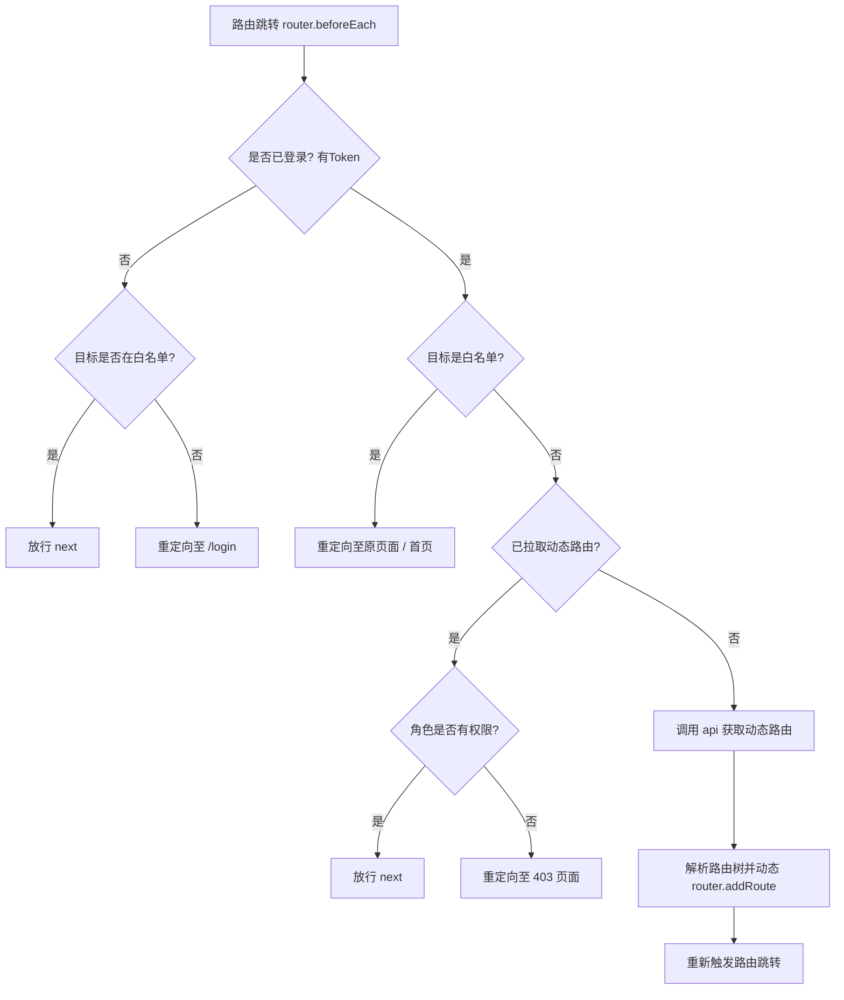
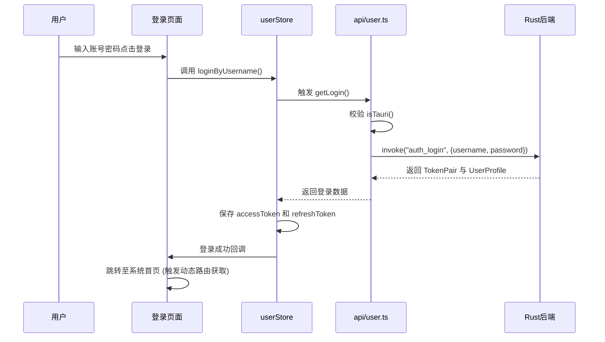

# pure-admin-thin 前端工程指南 (src)

本文档旨在介绍 `pure-admin-thin` (Vue 3 + TypeScript + Vite) 前端架构的设计理念、工程目录树、业务流转逻辑以及核心的 **API 接口安全保护机制**。

## 1. 核心特性：API 接口保护机制 (Tauri IPC)

本项目是基于 Tauri 桌面端运行环境高度定制的。为了保护核心业务接口不被通过常规 Web 环境（如浏览器直接访问、抓包等）非法调用，项目在 API 层采取了严格的**环境隔离与 IPC 封装**。

### 保护策略

在 `src/api/user.ts` 等核心接口文件中，我们舍弃了传统的 `Axios/fetch` 发送 HTTP 请求的方式，转而使用 Tauri 提供的进程间通信 (IPC) 机制：

```typescript
import { invoke, isTauri } from "@tauri-apps/api/core";

export const getLogin = (data?: object) => {
  // 1. 严格的环境隔离校验：防止在纯 Web 浏览器中直接运行
  if (!isTauri()) {
    return Promise.reject(
      new Error("`getLogin` only supports Tauri desktop runtime.")
    );
  }
  // 2. 通过 Tauri IPC 安全通道调用底层 Rust 命令
  return invoke<UserResult>("auth_login", { payload: data ?? {} });
};
```

**这种设计的安全优势：**

1. **防止 Web 攻击**：由于移除了传统 HTTP API，常见的 CSRF、XSS 窃取 Token 调接口等攻击面被大幅缩小。
2. **隐藏真实逻辑**：前端不再暴露后端的真实 IP 端口和路由，所有的请求均转化为底层 `invoke("command_name")` 离线调用。
3. **环境硬限制**：强制要求必须通过 Tauri Desktop 客户端壳子运行，拒绝浏览器直连访问。

---

## 2. 项目工程树介绍

`src` 目录按照功能模块和关注点分离的原则进行了精细的划分：

```text
src/
├── api/            # API 接口定义层（Tauri IPC 命令封装与类型定义）
├── assets/         # 静态资源（字体图标 iconfont、本地 SVG 等）
├── components/     # 全局复用组件（如 ReAuth 权限控制、ReIcon 图标组件等）
├── config/         # 运行时配置（解析 public/platform-config.json）
├── directives/     # Vue 全局自定义指令（如 v-auth, v-perms 等鉴权指令）
├── layout/         # 页面整体布局组件（侧边栏、导航头、多标签页 multi-tags）
├── plugins/        # 第三方插件注册（如 Element-Plus 按需引入）
├── router/         # 路由配置层
│   ├── modules/    # 静态路由模块碎片
│   ├── enums.ts    # 路由层级与状态枚举
│   ├── index.ts    # 路由实例创建与全局路由守卫 (beforeEach)
│   └── utils.ts    # 动态路由解析与树状结构拍平算法
├── store/          # 状态管理层 (Pinia)
│   ├── modules/    # 分治的 Store 模块（user, permission, multiTags, settings等）
│   └── index.ts    # Store 初始化
├── style/          # 全局样式控制
│   ├── reset.scss  # 浏览器默认样式重置
│   ├── index.scss  # 项目全局公用样式
│   └── tailwind.css# TailwindCSS 引入点
├── utils/          # 全局通用工具函数
│   ├── auth.ts     # Token 读写、用户信息存储逻辑
│   └── responsive.ts# 响应式 Storage 封装
├── views/          # 视图层（具体业务页面组件）
├── App.vue         # 根组件
└── main.ts         # 前端应用入口文件（Vue 实例创建与插件挂载）
```

---

## 3. 核心业务逻辑流程图

### 3.1 路由与权限守卫流转 (Router Guard)



### 3.2 登录验证流转 (Authentication Flow)



---

## 4. 核心依赖清单

前端项目采用了当今最流行的全家桶方案，保证了极佳的开发体验与运行性能。

### 基础核心框架

- **Vue** (`^3.5.22`): 核心视图框架，采用 Composition API。
- **Vue Router** (`^4.6.3`): 官方路由，支持动态路由和路由守卫。
- **Pinia** (`^3.0.3`): 新一代 Vue 状态管理库，取代 Vuex，提供更好的 TypeScript 支持。
- **Vite** (`^7.1.12`): 极速前端构建工具。

### UI 架构与样式

- **Element-Plus** (`^2.11.5`): 核心 UI 组件库，提供绝大多数基础组件。
- **Tailwind CSS** (`^4.1.16`): 原子化 CSS 框架，负责快捷布局与间距控制。
- **@iconify/vue**: 动态按需引入的图标库方案。
- **animate.css** / **@vueuse/motion**: 页面过渡与微动画库。

### 工具与增强库

- **@tauri-apps/api** (`^2.10.1`): Tauri 前端绑定库，实现 JS 与 Rust 的互操作。
- **@vueuse/core** (`^14.0.0`): 强大的 Vue 组合式 API 实用工具集。
- **axios** (`^1.12.2`): 读取本地 `public/platform-config.json` 的轻量 HTTP 客户端。
- **dayjs** (`^1.11.18`): 轻量级的时间/日期处理库。
- **js-cookie**: 本地登录态与用户信息存储。

### PureAdmin 生态

项目高度集成了 `@pureadmin` 系列工具链：

- **@pureadmin/utils**: 核心工具集抽象。
- **@pureadmin/table**: 强封装的高阶表格组件。
- **responsive-storage**: 带有响应式特性的本地存储库，关联 Pinia 状态。

---

## 5. 开发建议

1. **新增接口**: 永远优先使用 Tauri `invoke` 机制调用 Rust 命令。在 `src/api` 下编写接口时，必须带上 `isTauri()` 环境校验。
2. **路由配置**: 静态路由配置在 `src/router/modules` 中；需要权限过滤的路由应通过 Rust 后端返回 JSON 树，前端解析生成。
3. **样式修改**: 优先使用 Tailwind CSS 工具类处理局部样式，若必须写自定义 CSS，尽量放入 Vue SFC 的 `<style scoped lang="scss">` 中，全局主题相关写入 `src/style/index.scss`。
